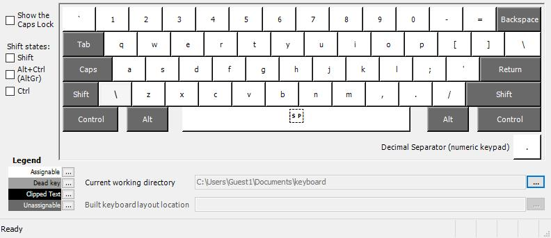
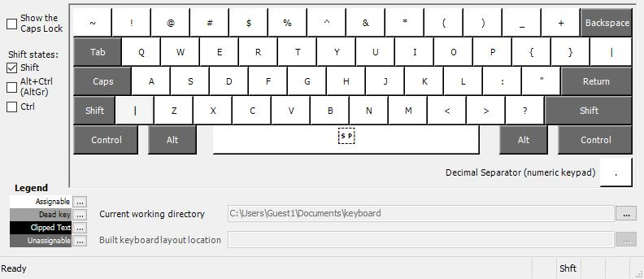
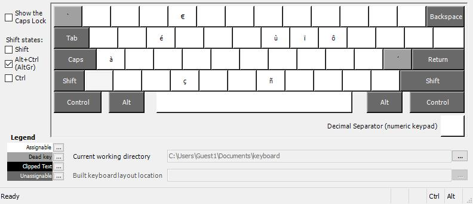
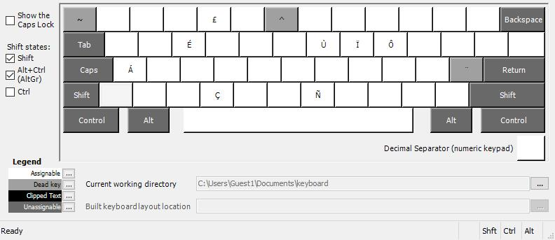

# QWERTY French layout

## English

This layout offers a way to use a US QWERTY keyboard while still being able to write in French without dead keys

## Français

Cette disposition permet d'utiliser un clavier US QWERTY tout en pouvant écrire en Français et sans touche morte

## Layout images

### Normal layout

### Shift layout

### Alr Gr layout

### Alr Gr + shift layout

